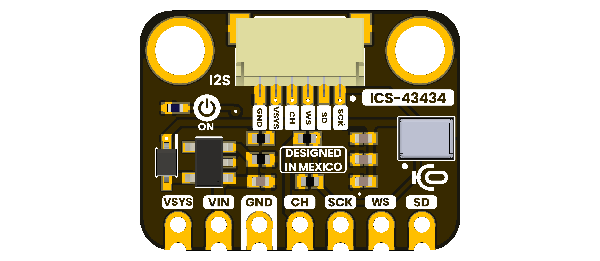
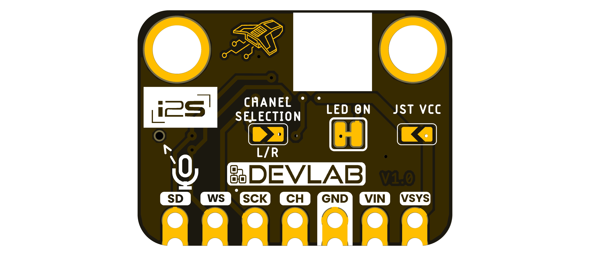

> **Note of Development:**
> This hardware module is under active development. File and directory
> structures, naming conventions, and documentation formats may change as the
> design evolves.
>
> - **File Naming:**
>   - Use capital letters and underscores only.
>   - Start filenames with `unit_<filename>_v_<version>_<description>.<ext>`.
>   - Example: `unit_i2s_ics43434_mems_microphone_v_1_0_0.png`
>   - Schematic: `schematic_v_<version>_<description>.<ext>`.
>   - Topology: `unit_topology_v_<version>_<description>.<ext>`.
>   - Dimensions: `unit_dimension_v_<version>_<description>.<ext>`.
>
> - **README Structure:**
>   - Hardware overview
>   - Pinout and connector layout
>   - Dimensions and topology
>   - Functional description
>   - Applications
>   - References
>
> Please refer to the latest commit history for updates and changes.

# Hardware

The DevLab I2S ICS-43434 MEMS Microphone is a compact digital-audio module
based on the bottom-port ICS-43434 microphone. The board views correspond to
hardware V1.0. Manufacturer part number: **UE0149**.

 Schematic: pending release

## Pinout

    <a href="https://github.com/UNIT-Electronics-MX/unit_devlab_i2s_ics_43434_mems_microphone/blob/main/hardware/resources/unit_top_v_1_0_0_i2s_ics43434_mems_microphone.png"> Top-side signal labels</a>
     
     
    <a href="https://github.com/UNIT-Electronics-MX/unit_devlab_i2s_ics_43434_mems_microphone/blob/main/hardware/resources/unit_btm_v_1_0_0_i2s_ics43434_mems_microphone.png"> Bottom-side signal labels</a>
     
     

| Pin Label | Direction | Function | Notes |
|---|---|---|---|
| `VIN` | Input | Module input supply | Allowed module range pending schematic verification |
| `VSYS` | Power | Module system rail | Routed to the JST supply contact |
| `GND` | Power | Common reference | 0 V |
| `CH` | Input | I²S channel selection | Low selects left; high selects right |
| `SCK` | Input | I²S serial bit clock | Driven by the host |
| `WS` | Input | I²S word select | Low is left word; high is right word |
| `SD` | Output | I²S serial audio data | 24-bit microphone output |

## Dimensions

The controlled dimensional drawing and mounting-hole coordinates are pending.
Do not scale mechanical dimensions from the rendered board views.

## Topology

| Ref. | Description |
|---|---|
| MK1 | ICS-43434 bottom-port digital MEMS microphone |
| U3 | AP2112K-3.3 fixed 3.3 V LDO regulator |
| D1 | Orange power indicator LED |
| D2 | NSR0320MW2T1G Schottky diode |
| J1 | 6-position JST-SH connector, 1.0 mm pitch |
| U$1 | Seven 2.54 mm edge connections |
| `L/R` | Channel-selection solder option |
| `LED ON` | Indicator solder option; behavior pending schematic verification |
| `JST VCC` | Connector-supply solder option; behavior pending schematic verification |

## Pin & Connector Layout

The seven edge connections expose `VSYS`, `VIN`, `GND`, `CH`, `SCK`, `WS`, and
`SD`. The six-position JST-SH connector exposes `GND`, `VSYS`, `CH`, `WS`, `SD`,
and `SCK`; `VIN` is available only on the edge connection.

| Signal | Electrical Information | Function |
|---|---|---|
| `VIN` | Module range pending | Input to the onboard power section |
| `VSYS` | Range pending | System and JST supply rail |
| `GND` | 0 V | Common power and signal reference |
| `CH` | Logic level pending module validation | Selects the I²S left or right time slot |
| `SCK` | Logic level pending module validation | Serial bit clock from the host |
| `WS` | Logic level pending module validation | Word-select clock from the host |
| `SD` | Digital output | Serial audio data to the host |

> **Note:** The BOM lists a four-conductor QWIIC-style harness while J1 is a
> six-position connector. Cable inclusion and compatibility must be verified
> before connection.

## Functional Description

The host supplies the I²S clocks on `SCK` and `WS`. The ICS-43434 converts the
acoustic signal and transmits 24-bit samples on `SD` in the time slot selected
by `CH`. The AP2112K provides a nominal 3.3 V rail for the microphone circuit.

Keep the bottom acoustic port unobstructed and free of debris, adhesive, flux,
or enclosure pressure. Connect the host and module grounds before applying
power or clocks. Do not drive `SD`; it is an output from the microphone.

### Electrical Characteristics

| Parameter | Value | Scope |
|---|---:|---|
| Microphone VDD | 1.62 V to 3.63 V | ICS-43434 supply pin |
| Digital output | 24 bit | ICS-43434 I²S interface |
| Signal-to-noise ratio | 64 dBA typical | Microphone characteristic |
| Frequency response | 60 Hz to 20 kHz | EMMIC-ICS43434 reference |
| Sensitivity tolerance | ±1 dB | Microphone characteristic |

The microphone VDD range and individual component ratings do not establish the
permitted voltage at the module's `VIN` pin.

### BOM-Confirmed Components

| Reference | Identification |
|---|---|
| MK1 | ICS-43434 |
| U3 | AP2112K-3.3TRG1 |
| J1 | JST SM06B-SRSS-TB |
| D2 | NSR0320MW2T1G |
| C8, C9 | 1 µF, 6.3 V, X5R, 0402 |
| C6 | 100 nF, 0402 |
| C1 | 200 pF, C0G, 50 V, 0402 |
| R1 | 4.7 kΩ, 0402 |
| R2, R3 | 10 kΩ, 0402 |
| R5 | 0 Ω, 0402 |

## Applications

- Voice capture and recognition prototypes
- Acoustic sensing and sound-event detection
- Intercom and teleconferencing systems
- Stereo and multi-microphone experiments
- Educational I²S audio acquisition

# References

- [EMMIC-ICS43434 Reference](https://github.com/UNIT-Electronics-MX/unit_devlab_i2s_ics_43434_mems_microphone/blob/main/hardware/resources/external/emmic-ics43434-ds.pdf)
- [Manufacturing BOM](https://github.com/UNIT-Electronics-MX/unit_devlab_i2s_ics_43434_mems_microphone/blob/main/hardware/resources/UNIT-0149%20Devlab_%20I2S%20ICS-43434%20MEMS%20Microphone-20260803T153602Z-1-001/UNIT-0149%20Devlab_%20I2S%20ICS-43434%20MEMS%20Microphone/Fabricaci%C3%B3n%20/BOM/UE0149%20-BOM-%20I2S%20ICS-43434%20-%20P.xlsx)
- [Experimental I²S Example](https://github.com/UNIT-Electronics-MX/unit_devlab_i2s_ics_43434_mems_microphone/blob/main/software/examples/i2s/i2s.ino)
